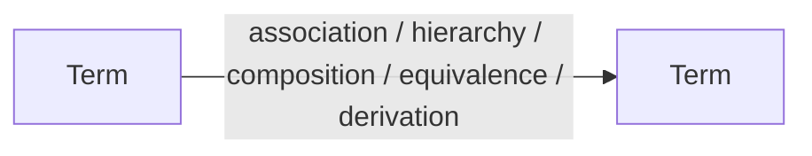
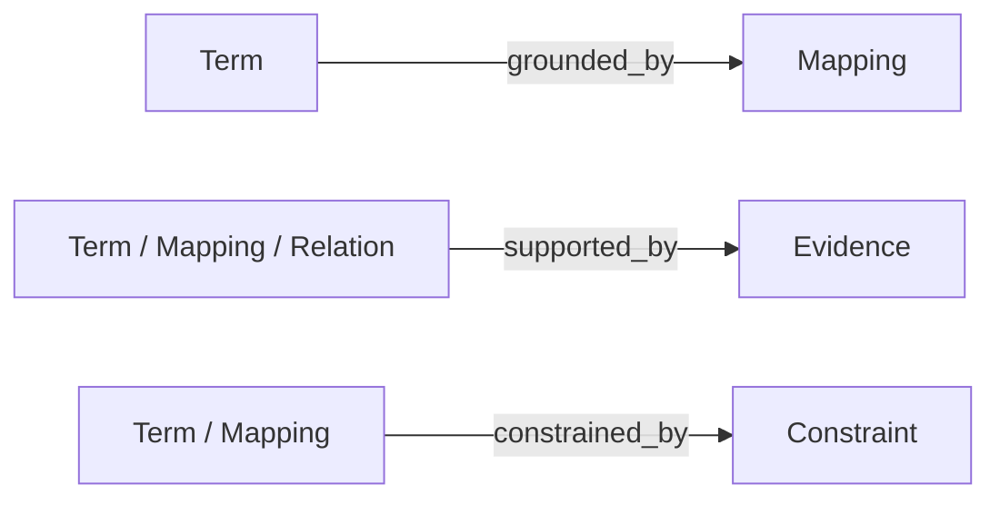

# Ontology Layer Schema v1

## Purpose

This document defines the content representation used by the ontology layer.

The Content Layer provides an ontology-inspired representation that connects analytical requirements with evidence from the underlying data environment. The broader ontology state also includes a Schema Layer and a Tool Layer; this document defines the Content Layer objects and their permitted relationships.

The schema is benchmark-independent. Specific semantic knowledge is generated by the Builder Agent based on workload requirements and data-environment exploration.

The Content Layer does not store:

- benchmark-specific answers;
- hidden reasoning logic;
- agent execution policies;
- hard-coded rules.

The Content Layer stores reusable, evidence-grounded analytical knowledge.

---

# Content Layer Structure

The Content Layer is a typed semantic graph with four node families and two edge families.

**Node families:**

- Term;
- Mapping;
- Constraint;
- Evidence.

**Edge families:**

- Semantic Relation;
- Structural Reference.

For storage and versioning, Semantic Relations are represented as addressable `Relation` records. The serialized Content Layer therefore contains five record types:

```
Content Layer
├── Term
├── Mapping
├── Relation
├── Constraint
└── Evidence
```

Terms represent analytical concepts, Mappings ground them to data structures, Constraints govern their valid use, and Evidence supports semantic claims. Semantic Relations connect Terms, while Structural References connect Terms to Mappings and attach Constraints and Evidence to the objects they govern or support.

---

# 1. Term

## Purpose

Term is the fundamental semantic unit of the ontology layer.

A Term represents a reusable analytical concept that an analysis agent may need to discover or use.

A Term can represent:

- business concepts;
- analytical metrics;
- entities;
- dimensions;
- categories.

The schema intentionally uses a unified Term abstraction instead of forcing a fixed ontology hierarchy.

The Builder Agent determines the appropriate Term type based on workload requirements.

---

## Fields

```yaml
id:
  Unique identifier of the semantic object

name:
  Human-readable semantic name

type:
  Semantic category.

  Possible values:
  - concept
  - metric
  - entity
  - dimension
  - category

definition:
  Clear explanation of the semantic meaning

scope:
  Applicable context or usage boundary

aliases:
  Alternative names or expressions

evidence:
  References to supporting evidence
```

---

## Example

```yaml
id:
  labor_cost

name:
  Labor Cost

type:
  metric

definition:
  Employee-related operating expenses

scope:
  Company operating expense analysis
```

---

# 2. Mapping

## Purpose

Mapping connects Terms with physical structures in the underlying data environment.

Mapping provides executable grounding for semantic knowledge.

A Mapping explains how a semantic concept can be located or interpreted in a database, file, document, or other supported source.

---

## Fields

```yaml
id:
  Unique identifier

term_id:
  Related semantic object

database_source:
  Database identifier

table:
  Related database table

column:
  Related database column

semantic_filter:
  Optional semantic condition that must hold for this mapping to be valid.
  Describes WHAT constraint applies to the data (e.g., "only active records"),
  not HOW to write a WHERE clause. Must be grounded in evidence.

aggregation_semantics:
  Semantic description of how this concept should be aggregated
  (e.g., "sum of individual expenses", "average across time periods").
  Describes the meaning of aggregation, not the SQL function to use.

grain:
  Data granularity

validation:
  Verification information
```

---

## Example

```yaml
id:
  mapping_labor_cost

term_id:
  labor_cost

database_source:
  financial_database

table:
  expense_statement

column:
  labor_expense

aggregation_semantics:
  sum of labor expenses

grain:
  annual
```

---

# 3. Relation (Semantic Relation)

## Purpose

A Relation is the serialized form of a Semantic Relation edge between Terms.

Semantic Relations enable agents to understand analytical structure beyond isolated concepts, including hierarchy, composition, equivalence, derivation, and broader association.

Relations store WHAT the connection means, not HOW to query it.

---

## Fields

```yaml
id:
  Unique identifier

source:
  Source Term id

relation_type:
  Type of relationship. Must be one of the five controlled values defined below.

target:
  Target Term id

connection_condition:
  Optional evidence-grounded description of how two concepts are connected
  at the data level. This is a semantic description of the connection, not a SQL query template.
  For database-backed benchmarks, this may reference column relationships
  (e.g., "drivers.driverId corresponds to results.driverId").
  For non-database benchmarks, this may describe any observable connection
  (e.g., "company_id links financial events across filing periods").

description:
  Explanation of the relationship

evidence:
  Supporting evidence
```

---

## Relation Types

The `relation_type` field MUST use one of the following five controlled values. Free-text types such as `affects`, `belongs_to`, or `related_to` are not permitted.

### Type Definitions

#### `association` — General Business Association

Two Terms are semantically related in the business domain, but no direct or stable structural connection exists at the data level. This is a weak association for semantic understanding only.

**`connection_condition` is optional.** If an indirect connection path exists, it may be noted but should be marked as indirect.

**Judgment criteria:**
- Two concepts frequently co-occur or reference each other in the workload
- Cannot be expressed as a direct structural connection
- **This is the fallback type. Use only when none of the other four types apply.**

**Example:**
```yaml
id: rel_driver_nationality
source: term_driver
relation_type: association
target: term_country
connection_condition: ""
description: Driver nationality relates to country information, but accessed through a nationality text column rather than a direct identifier reference to a country table
```

---

#### `hierarchy` — is-a Hierarchy

Child is an **instance or subclass** of the parent. The child's value domain is a subset of the parent's value domain.

**`connection_condition` is optional.**

**Judgment criteria:**
- Child value domain ⊆ Parent value domain (verifiable by comparing distinct values)
- Relationship is "is-a", not "part-of"
- Pure conceptual example: `Sedan` is-a `Vehicle`; `City` is-a `GeographicArea`

**Distinction from `composition`:**
- `hierarchy`: child is an **instance** of the parent category
- `composition`: child is a **component part** of the parent whole

**Note:** Do not use `hierarchy` for relationships where child is merely associated with parent through a foreign key. A race is NOT "a kind of" circuit — that relationship is `association` or `composition`. Reserve `hierarchy` for genuine type/subtype or instance/category relationships.

**Example:**
```yaml
id: rel_vehicle_car
source: term_vehicle
relation_type: hierarchy
target: term_car
connection_condition: ""
description: A car is a specific type of vehicle; all car attributes are a subset of vehicle attributes
```

---

#### `composition` — part-of Composition

Child is a **component part** of the parent whole. Child records cannot meaningfully exist without the parent record.

**`connection_condition` is optional.**

**Judgment criteria:**
- Child data source references parent data source via an identifier
- Removing the parent record would render child records meaningless
- Relationship is "part-of", not "is-a"

**Example:**
```yaml
id: rel_district_schools
source: term_district
relation_type: composition
target: term_school
connection_condition: schools references district via district identifier
description: A district is composed of multiple schools; a school cannot exist without a district
```

---

#### `equivalence` — Semantic Equivalence

Two Terms mapped to different physical columns (possibly in different tables or data sources) express the **same business concept**.

**`connection_condition` is optional.**

**Judgment criteria (any one is sufficient):**
- Columns in different data sources share the same value domain (verified by sampling)
- Workload questions use the concept names interchangeably
- Names differ only by naming convention (e.g., `driver_id` vs `driverRef`)

**Value:** When an agent searches for one concept, equivalence relations help it discover synonymous representations in other data sources.

**Example:**
```yaml
id: rel_driver_id_equiv
source: term_driver_id
relation_type: equivalence
target: term_driver_ref
connection_condition: ""
description: drivers.driverId and results.driverId refer to the same drivers; driverRef is an alternative human-readable identifier
```

---

#### `derivation` — Derivation

One concept (target) is **computed or inferred** from one or more source concepts.

**`connection_condition` is optional.**

**Judgment criteria:**
- Target = f(source₁, source₂, ...), where f is a well-defined mathematical or logical formula
- Example: `growth_rate = (current - previous) / previous`
- Example: `full_name = first_name || ' ' || last_name`

**Value:** When an agent needs a derived metric that has no pre-existing data column, derivation relations describe reusable metric semantics and dependencies, enabling the agent to understand what the metric means and what it depends on.

**Example:**
```yaml
id: rel_fastest_lap_derived
source: term_lap_time
relation_type: derivation
target: term_fastest_lap
connection_condition: ""
description: Fastest lap is derived as the minimum lap time per driver per race
```

---

### Decision Priority

When assigning `relation_type`, evaluate in this order:

1. Value domain has subset relationship (child ⊆ parent) AND relationship is "is-a" → `hierarchy`
2. Child references parent via identifier, child cannot exist independently → `composition`
3. Different data sources/columns express the same business concept → `equivalence`
4. Target computed from source concepts via formula → `derivation`
5. None of the above, but concepts have business relevance → `association`

### Common Mistakes

| Mistake | Correction |
|---------|-----------|
| `hierarchy` and `composition` used interchangeably | `hierarchy` = is-a (type/subtype); `composition` = part-of (whole/component) |
| `hierarchy` used for FK relationships that are not type/subtype | A race references a circuit via FK, but a race is NOT "a kind of" circuit — use `association` or `composition` instead |
| `equivalence` never used | Cross-source synonymous concepts should use `equivalence` to help agents discover alternative representations |
| `derivation` not used | Metrics with computational relationships must use `derivation` |
| Free-text types like `affects`, `belongs_to` | Must use one of the five controlled types |
| `connection_condition` contains SQL-specific syntax | Describe the connection semantically; do not write SQL templates |
| Table JOIN relationships stored as semantic Relations | JOINs are physical table connections, not ontological relations; use `association` for concept-level relatedness instead |

---

# 4. Constraint

## Purpose

Constraint represents conditions required for correct interpretation and usage of semantic objects.

Constraints prevent incorrect semantic application by making data interpretation rules, business definitions, and applicability conditions explicit and discoverable.

Examples:

- valid time range;
- required aggregation level;
- unit requirements;
- applicable scenarios;
- enumeration value semantics (e.g., "status=1 means active").

Constraints must be discoverable at runtime. The `trigger_keywords` field enables agents to find relevant constraints even when they do not know the exact constraint id or target term.

---

## Fields

```yaml
id:
  Unique identifier

target:
  Related semantic object (Term or Mapping id)

constraint_type:
  Constraint category. Recommended values:
  - enum_semantics: explains what enumeration values mean
  - data_quality: records known data issues or limitations
  - business_rule: documents business logic or domain rules
  - unit: specifies required units or normalization
  - scope: defines applicable time range, context, or conditions

trigger_keywords:
  Keywords and phrases that should trigger discovery of this constraint.
  Include natural-language expressions that appear in analytical questions.
  Example: ["normal range", "IGA", "reference value", "healthy"]

severity:
  How critical this constraint is for correct interpretation:
  - block: violating this constraint produces incorrect results
  - warning: violating this constraint may affect quality
  - info: supplementary information

scope:
  Applicable context or usage boundary for this constraint

confidence:
  Confidence level: high | medium | low

description:
  Human-readable explanation of the constraint rule

evidence:
  Supporting evidence
```

---

## Example

```yaml
id:
  constraint_iga_normal_range

target:
  term_iga_lab_value

constraint_type:
  enum_semantics

trigger_keywords:
  - normal range
  - IGA
  - normal IGA
  - within normal
  - abnormal

severity:
  block

scope:
  Applies when filtering or interpreting IGA lab results

confidence:
  high

description:
  IGA values within 70-400 mg/dL are considered normal range.
  Values outside this range indicate abnormal immunoglobulin A levels.
  Queries filtering for "normal" IGA must use this range.

evidence:
  evidence_iga_range_validation
```

---

# 5. Evidence

## Purpose

Evidence stores verification information supporting semantic objects and claims.

Evidence ensures that semantic knowledge is grounded in reproducible observations from the underlying data environment.

Every active semantic claim should be traceable to evidence.

---

## Fields

```yaml
id:
  Unique identifier

source:
  Evidence source

query:
  Database exploration query

result:
  Observed result

validation_method:
  Verification approach

timestamp:
  Creation time
```

---

## Example

```yaml
id:
  evidence_001

source:
  financial_database

query:
  SELECT DISTINCT category FROM expenses

result:
  labor_expense exists

validation_method:
  schema and value verification
```

---

# Semantic Object Relationships

The graph contains two edge families.

## Semantic Relations

Semantic Relations connect Terms and are stored as `Relation` records.



## Structural References

Structural References are induced by object references rather than stored as independent semantic claims.



---

# Design Principles

## 1. Evidence Grounding

Every semantic claim must be supported by reproducible evidence from the underlying data environment.

Unsupported semantic knowledge should not be added.

---

## 2. Reusable Knowledge

Semantic objects should represent reusable analytical capabilities rather than individual benchmark solutions.

---

## 3. Separation of Knowledge and Execution

The ontology layer stores meaning and data grounding.

It does not store:

- agent strategies;
- prompts;
- execution workflows;
- hidden rules.

---

## 4. Minimal Representation

The Builder Agent should create only semantic objects necessary for supporting the target workload.

Avoid exhaustive domain catalogs.

---

## 5. Evolution Compatibility

The semantic schema remains stable during initialization.

Future evolution may modify:

- semantic content;
- interaction tools;
- semantic representation architecture;

when evidence indicates that the current design cannot satisfy analytical requirements.
